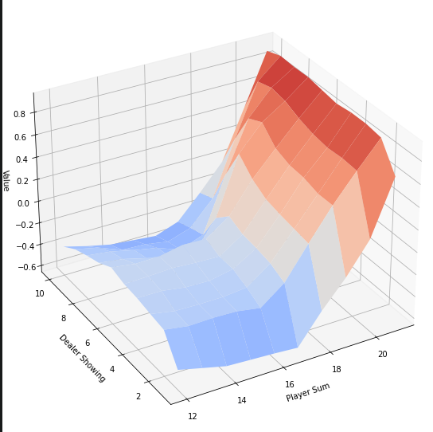
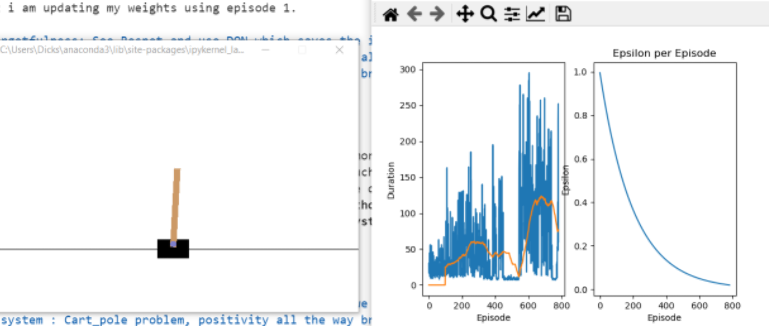
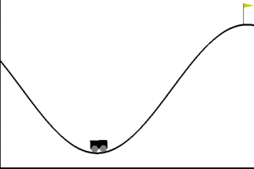
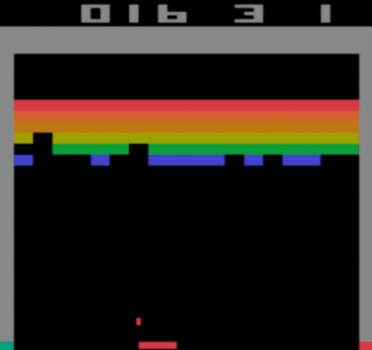

# Project - RL Beginner Pratice

### Description
This repo is my intepretation practice of the exercises shown in David Silver's youtube course "Introduction to RL" (https://www.youtube.com/watch?v=2pWv7GOvuf0&list=PLqYmG7hTraZDM-OYHWgPebj2MfCFzFObQ&ab_channel=DeepMind). 
It includes some algorithms DDQN, A2C, Policy based, Value based and the most fundamental dynamic programming.

### Requirement
* [python 3.7](https://www.python.org) 
* [pytorch 1.0.1](https://pytorch.org/)
* [gym 0.13.1](https://github.com/openai/gym)

### Environment

Most of the environment is simulated with basic python while some of it is simulated with openai's gym.

### Examples 

Blackjack using monte_carlo control

Cartpole dense reward problem

Mountain Climber sparse reward problem

Breakout using DDQN and Experience replay
